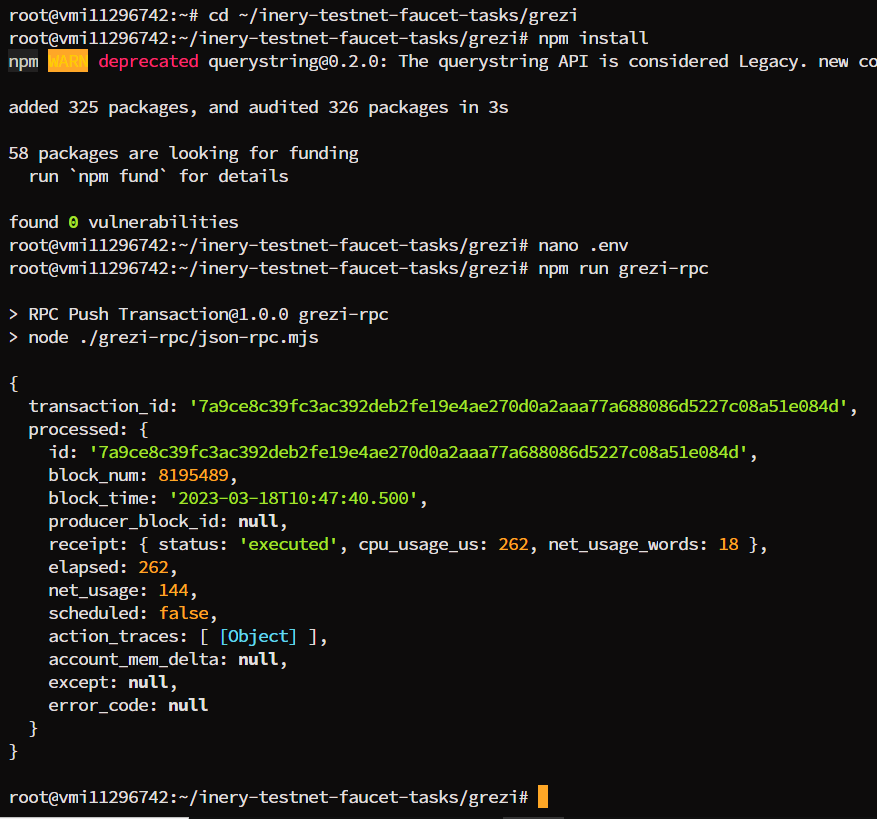

# Json RPC Sample for Task 4 Inery Blockchain
A Sample code to call JSON RPC on Inery Blockchain



### Prerequisites

- node js
- npm

### Installation

1. Clone the repo

   ```
   git clone -b task4 https://github.com/HinggaRana/inery-testnet-faucet-tasks
   ```

2. Change directory to our rpc solution ~/grezi

   ```
   cd ~/inery-testnet-faucet-tasks/grezi
   ```

3. Install NPM packages

   ```
   npm install
   ```

4. Create `.env` file

   ```
   touch .env
   ```

5. Edit ```.env``` file with your information

- INERY_ACCOUNT="your_inery_account"
- PRIVATE_KEY="your_private_key"
- NODE_URL="http://your_IP_VPS:8888"

## Usage

Run RPC grezi

```
npm run grezi-rpc
```
or
```
node ./grezi-rpc/json-rpc.mjs
```
